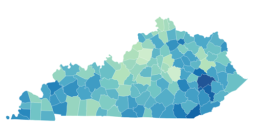

 Laxmi Adhikari 

I enjoy making sense of complex information and finding patterns. My background in business analysis, ux design, and Business Analytics has shaped a structured and detail-oriented approach to problem solving. I genuinely enjoy exploring data, not just at work, but also through reports and research about the world around us. Outside of analytics, hiking is my favorite way to disconnect and recharge in nature.

<!-- 

    SQL
    Power BI
    DAX
    Data Modeling
    Excel
    Python

 -->

<h2>Featured Projects</h2>

<h3> Healthcare Pricing Disparities</h3>

Analyzed negotiated rates, cash prices, and gross charges across 3 major hospitals in Louisville, KY 

<a class="project-button" href="/projects/price-transparency">View Project →</a>

    Power BI
    Python
    <!-- DAX -->
    Star Schema

<!-- card 3 -->

    

    

    <h3> County-Level Heart Disease Mortality</h3>

    
Analyzed county-level heart disease mortality disparities across Kentucky to identify high-burden regions.

    <a class="project-button" href="/projects/cdc">View Project →</a>
    

        Excel
        Datawrapper
    

    

 

    

    

    <h3>Test</h3>

    
Analyzed county-level heart disease mortality disparities across Kentucky to identify high-burden regions.

    <a class="project-button" href="/projects/price">View Project →</a>
    

        Excel
        Datawrapper
    

    

 
<!-- end of card -->

<!-- card2 -->

<!-- 

<h3> Hospital Analytics</h3>

Hosptital A

<a class="project-button" href="/projects/patient-encounter">View Project →</a>

    SQL
   

 -->
<!-- end of card -->

## Education

<h2>Master of Science in Business Analytics</h2>
University of Louisville (Expected Graduation: July 2026)

### Let's Connect

    <!-- <a class="btn btn-link" href="/resume/resume.pdf" target="_blank">📄 Resume</a>  -->
    <a class="btn btn-link" href="https://www.linkedin.com/in/laxmiadh/" target="_blank">LinkedIn</a>
    <a class="btn btn-link" href="https://github.com/laxmiadh08" target="_blank">GitHub</a> 

