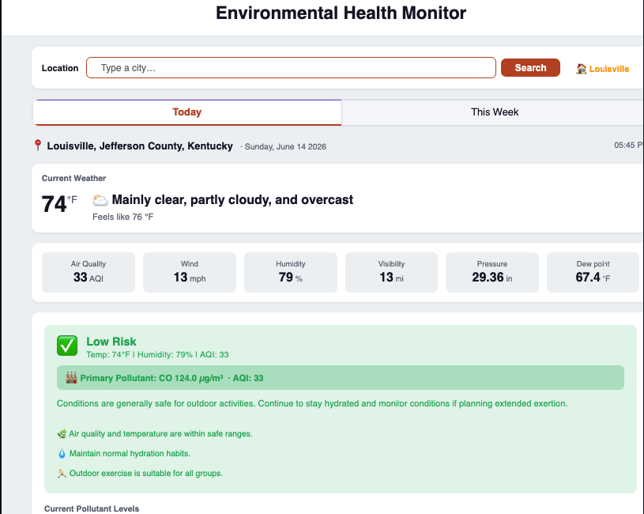

<h1> Laxmi Adhikari </h1>
I am a Data Analyst with experience in SQL, Python, Power BI, PostgreSQL, ETL development, and business intelligence.

I enjoy solving business problems through data visualization, automation, and predictive analytics.

<h2>Featured Projects</h2>

<h3> Environmental Health Monitoring</h3>

Real-time ETL dashboard using APIs.

<a class="project-button" href="/projects/environmental-health">View Project →</a>

<!-- card 2 -->

<h3> Environmental Health Monitoring</h3>

Real-time ETL dashboard using APIs.

<a class="project-button" href="/projects/environmental-health">View Project →</a>

<!-- card3 -->

<h3> Environmental Health Monitoring</h3>

Real-time ETL dashboard using APIs.

<a class="project-button" href="/projects/environmental-health">View Project →</a>

## Education

<h2>Master of Science in Business Analytics</h2>
University of Louisville (Expected Graduation: July 2026)

### Let's Connect

    <!-- <a class="btn btn-link" href="/resume/resume.pdf" target="_blank">📄 Resume</a>  -->
    <a class="btn btn-link" href="https://www.linkedin.com/in/laxmiadh/" target="_blank">LinkedIn</a>
    <a class="btn btn-link" href="https://github.com/laxmiadh08" target="_blank">GitHub</a> 

